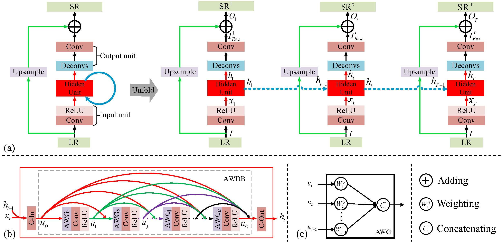
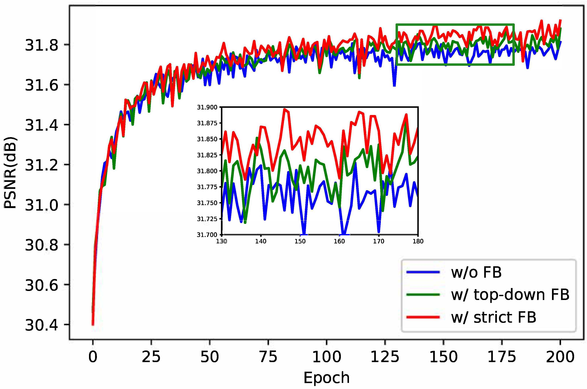
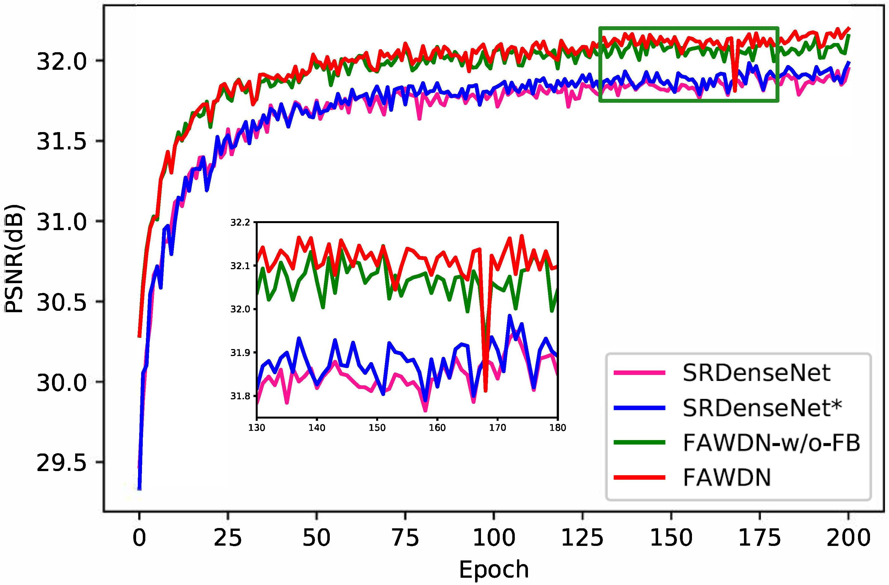
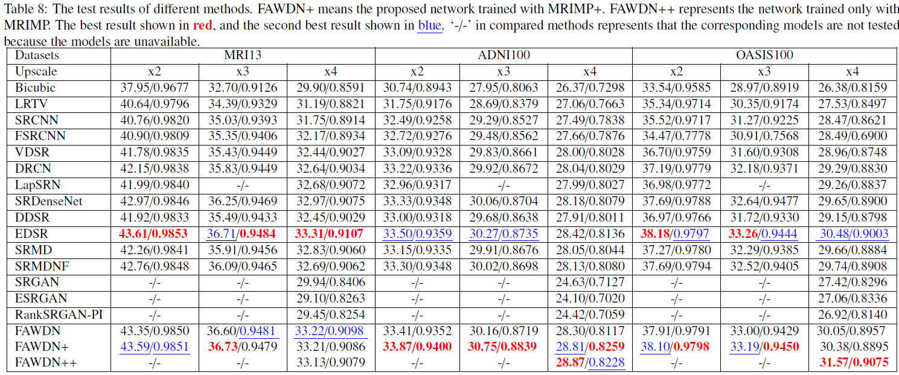
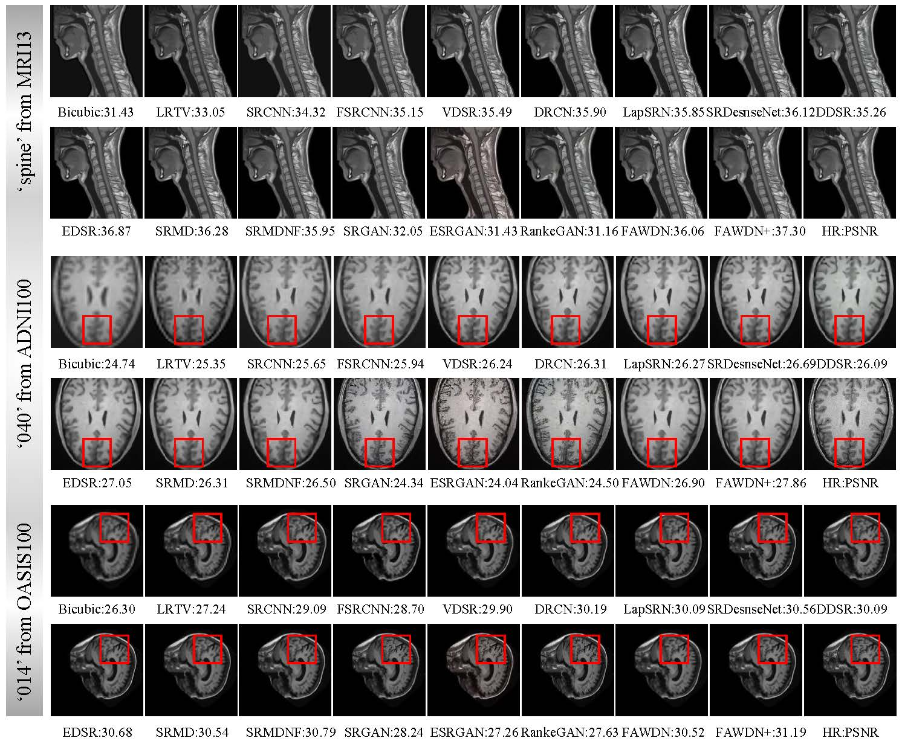

# FAWDN
Medical image super-resolution with feedback adaptive weighting dense network 

## A trusted medical image super-resolution method based on feedback

This repository is Pytorch code for our proposed FAWDN for MR image super-resolution. 



## Contents

1. Requirements
2. Training
3. Test
4. Ablation Study
5. Results
6. Acknowledgements

## 1. Requirements 

1. python3
2. pytorch (>=1.0)
3. tqdm
4. cv2


## 2. Quick Test

1. Clone this repository:

   ```
   git clone https://github.com/Huises/FAWDN.git
   ```

2. Download our pre-trained models from the links below, unzip the models and place them to `./models`.

3. Then, cd to **FAWDN** and run **one of following commands** for evaluation on *MRI13* (or your own images):

   ```
   python test.py -opt options/test/test_FAWDN_x2.json
   python test.py -opt options/test/test_FAWDN_x3.json
   python test.py -opt options/test/test_FAWDN_x4.json
   ```

4. Finally, PSNR/SSIM values for *MRI13* (or your own images) are shown on your screen, you can find the reconstruction images in `./results`.

## 3. Ablation Study 

1. Investigation of the feedback mechanism.

   

   Fig. 1. The investigation of the feedback mechanism.

   

   

   Fig. 2. The visual comparison of reconstructed ‘abdomen’ in MRI13 at different time step. From left to right in the top row, there are the result at the 1st time step SR1, the result at the 2nd time step SR2, the contrast enhanced residual image between the HR image and SR1, and the contrast enhanced residual image between the HR image and SR2. In the bottom row, we zoom in two areas in corresponding residual images.

   

3. Investigation of adaptive weighting groups.

   

   Fig. 3. The investigation of adaptive weighting groups.
   
   

## 4. Results





## 5. Acknowledgements

Thank [Paper99](https://github.com/Paper99). Our code structure is derived from his repository [SRFBN](https://github.com/Paper99/SRFBN_CVPR19).

